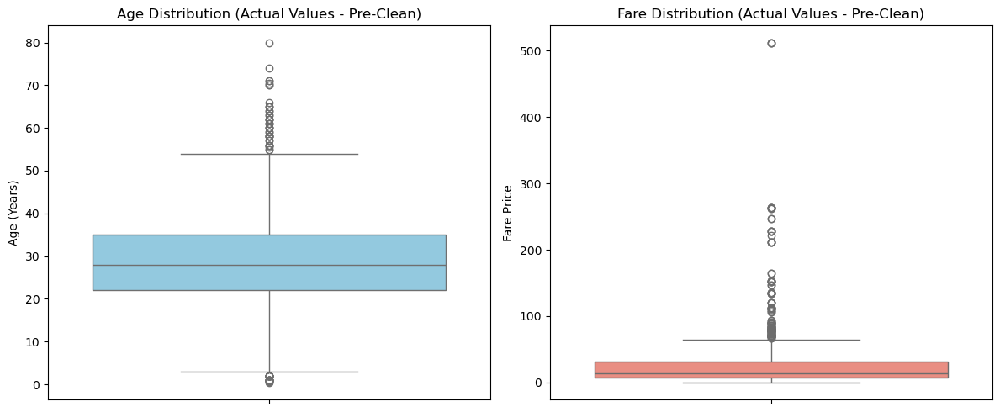
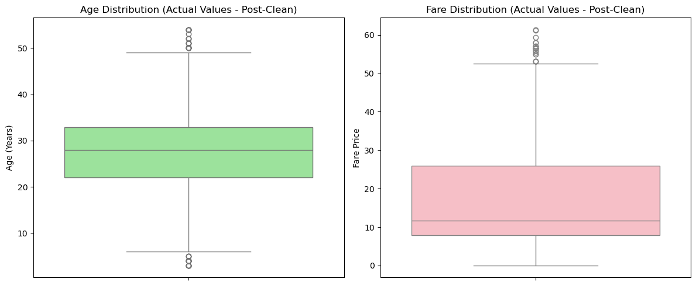

# Task 1: Data Cleaning & Preprocessing (Titanic Dataset)

This repository contains the completed deliverables for **Task 1** of the AI & ML Internship. The main objective of this project was to take a raw, uncleaned dataset containing structural gaps and mathematical anomalies, and transform it into a refined, numerical, and standardized format optimized for machine learning algorithms.

---

## 🛠️ Preprocessing Pipeline & Methodology

The data engineering pipeline was executed systematically to ensure maximum data integrity:

1. **Exploratory Data Analysis (EDA):** Evaluated data types (`int64`, `float64`, `object`) and mapped out missing data structural health across the features using visual heatmaps.
2. **Handling Missing Values:** * Imputed the `Age` column using its **median** to minimize the impact of existing skewness.
   * Filled missing records in `Embarked` using the **mode** (most frequent port).
   * Dropped the `Cabin` column entirely due to a critical vacancy rate (>70% missing data).
3. **Categorical Encoding:** Converted non-numeric features into algorithms-compliant formats:
   * **Binary Label Encoding** for the `Sex` column (`male`/`female` -> `0`/`1`).
   * **One-Hot Encoding** for the `Embarked` ports, generating distinct dummy boolean columns (`Embarked_C`, `Embarked_Q`, `Embarked_S`).
4. **Feature Scaling:** Applied `StandardScaler` to continuous variables (`Age` and `Fare`). This mathematically shifted their distributions to a mean  of `0` and a standard deviation  of `1`, preventing columns with larger raw ranges from dominating model weights.
5. **Outlier Mitigation:** Utilized the **Interquartile Range (IQR)** filtering method to isolate and truncate extreme data anomalies that could otherwise severely warp model boundary lines.

---

## 📊 Before & After Cleaning Visualizations

To verify the structural impact of the preprocessing pipeline, distributions were tracked using boxplots before and after applying the mathematical filters.

### 1. Initial State (Actual Values - Pre-Clean)
* **What it shows:** The real-world distributions of passenger profiles. The `Age` span ranges up to 80 years old, while the `Fare` profile features a massive, highly skewed extreme outlier.


### 2. Final State (Actual Values - Post-Clean)
* **What it shows:** The distribution after passing through the IQR filters. 


---

## Repository Structure

* `task1_preprocessing.ipynb` — The step-by-step interactive Jupyter Notebook containing all raw exploratory data analysis, visualizations, and data manipulation code.
* `cleaned_titanic.csv` — The final exported dataset featuring fully imputed values, encoded categoricals, mitigated outliers, and standardized features.
* `Pre-Clean.png` & `Post-Clean.png` — Distribution boxplots mapping feature behavior through the cleaning lifecycle.

---

### Prerequisites
Ensure to have Python 3.x and the necessary numerical/data libraries installed:
```bash
pip install numpy pandas matplotlib seaborn scikit-learn